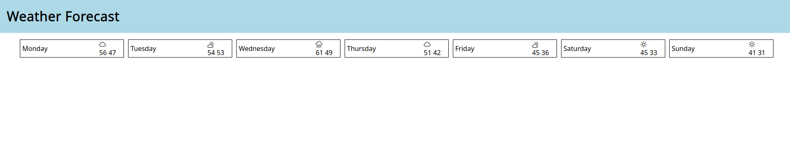
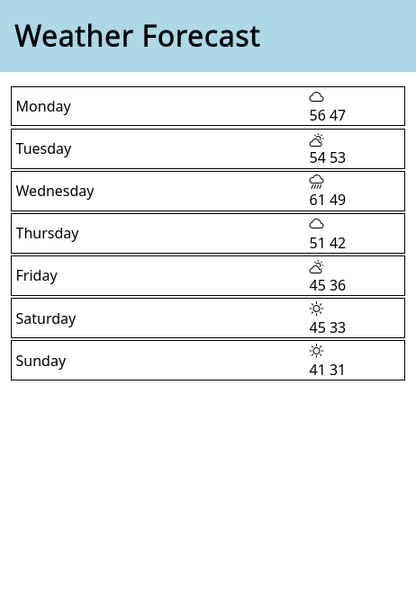

# Introduction

Over the next few assignments, we're going to build a site that displays the weather forecast.

# Assignment 2: HTML and CSS

## The Brief

Create a (static) page showing a 7 day weather forecast. (Yes, it will get a bit repetitive without the ability to write a for loop.)

You should have a `header` with the words "Weather Forecast" in a header bar across the top with a background color (mine is `lightblue`).

Your website should be *responsive*, meaning that it shows the forecast as a single row when the viewport is at least 800px wide,
and switch to showing the forecast as a single column when the viewport is smaller.

You can make up your own weather or just copy mine.

For example, here's what it looks like on desktop:



Here's what it looks like on mobile:



## Details

### main.css

The first three lines of `main.css` are:
```css
@import url("https://fonts.googleapis.com/css2?family=Noto+Sans&display=swap");
@import url("https://cdn.jsdelivr.net/npm/normalize.css@8.0.1/normalize.css");
@import url("https://cdn.jsdelivr.net/npm/bootstrap-icons@1.10.3/font/bootstrap-icons.css");
```

This uses the [CSS import rule](https://developer.mozilla.org/en-US/docs/Web/CSS/@import) to fetch the Noto Sans font, `normalize.css` and `bootstrap-icons.css`.

There's also a rule defined for a `visually-hidden` class, which will prevent an element being visible on the screen while still being available for screen-reader (basically the opposite of `aria-hidden=true`).
```css
.visually-hidden {
  clip: rect(0 0 0 0);
  clip-path: inset(50%);
  height: 1px;
  overflow: hidden;
  position: absolute;
  white-space: nowrap;
  width: 1px;
}
```

### Icons

See the [Bootstrap Icons documentation](https://icons.getbootstrap.com/#usage) for usage instructions. Because we imported the CSS above, we're set up to use the web fonts via CSS:
```css
<i class="bi-cloud-sun" aria-hidden="true"></i>
```

### Accessibility

`screenreader.mp4` is a recording of [Orca](https://help.gnome.org/users/orca/stable/index.html.en) reading my version. The main thing to note is that it reads the icons (it's actually ignoring the icons) -- how can you tell it what to read? 

Information on how to set up a screen reader on various OSs can be found [on this page](https://cccaccessibility.org/assistive-tech/screen-readers). (There's one built in on OS X and on Windows 11. NVDA is free on older versions of Windows.)


### Checklist

- [ ] format your code with `pnpm format`
- [ ] lint your code with `pnpm lint`
- [ ] make sure the tests pass with `pnpm test` (this runs the `axe` acessibility linter, which doesn't catch everything, but is a start)
- [ ] grab the [WAVE browser extension](https://wave.webaim.org/extension/) and check for errors and warnings

If you're submitting on Blackboard, upload a zip file named `<your_name>.zip`. The following command will zip up the folder (but not `node_modules`. Please don't hand in `node_modules`!):
```bash
zip -r my_name.zip . -x './.git/*' -x './node_modules/*' -x *.mp4
```

## Resources

- https://developer.mozilla.org/en-US/docs/Learn/CSS/CSS_layout
- [CSS Layout Cookbook](https://developer.mozilla.org/en-US/docs/Web/CSS/Layout_cookbook)
